# 🚀 Khortytsia - A Serverless Data Ingestion & Analysis Pipeline 🧠


Khortytsia is a lightweight, high-performance, serverless data ingestion and analysis pipeline built on Google Cloud. It's designed to fetch data from various sources, filter it for relevance, use the power of Gemini Pro to extract valuable business insights, and store them for analysis.

## How It Works: The 6 Modules

The pipeline is a journey that an article takes through six distinct, automated stages. The goal is to transform a raw news story from the internet into a verified, actionable sales lead.

1.  **The Hunt (Data Ingestion)**: A scheduler kicks off the process every 30 minutes. A series of functions scan news sites and APIs for articles containing keywords like "investment" or "expansion."

2.  **The Analysis (Core Analysis)**: Relevant articles are passed to the pipeline's brain: the Gemini Pro model via Vertex AI. It reads the article and structures the key information into a JSON format, identifying the company, opportunity, and potential needs.

3.  **The Verification (The Shield & The Editor)**: The AI's analysis is sent down two parallel paths simultaneously. One path fact-checks the claims against external sources to generate a `confidenceScore`. The other path checks the analysis for internal consistency and adherence to business rules to generate a `qualityScore`.

4.  **The Verdict (Decision & Review)**: A central decision engine looks at both the confidence and quality scores. If they are high, the lead is **Auto-Approved**. If they are low, it's rejected. If they are in the middle, the lead is flagged for **Human Review**.

5.  **The Correction (Human-in-the-Loop)**: A human analyst can view all flagged leads in a simple web interface. They can approve, discard, or correct the AI's analysis. These corrections are saved to a separate database, creating a valuable dataset to fine-tune and improve the AI over time.

6.  **The Bounty (Delivery & Visualization)**: All approved leads are streamed directly into a **BigQuery** database. From there, they can be used to trigger real-time alerts (e.g., in Slack) or to build strategic dashboards for market analysis.

## 🏛️ Architecture



## 🧩 Functions & Components

The project is divided into independent services, each corresponding to a part of the pipeline.

| Module | Component(s) | Description |
| :--- | :--- | :--- |
| **1. Ingestion** | `trigger_ingestion_cycle`, `fetch_source_data`, `filter_article_content` | Finds and filters relevant articles. |
| **2. Analysis** | `core_analysis` | Uses Gemini on Vertex AI to extract insights. |
| **3. Verification** | `external_verification`, `internal_qc` | Fact-checks and quality-checks the AI output. |
| **4. Decision** | `decision_engine`, `workflow.yaml` | Orchestrates verification and makes final judgment. |
| **5. Human Review** | `get_manual_review`, `submit_correction`, `manual_review_interface` | Provides a UI for human oversight and correction. |
| **6. Delivery** | `delivery_alerter`, BigQuery Table | Sends real-time alerts and stores data for dashboards. |

## 🚀 Getting Started & Deployment

### Prerequisites

*   A Google Cloud Platform project with billing enabled.
*   [Terraform](https://learn.hashicorp.com/tutorials/terraform/install-cli) installed.
*   [gcloud CLI](https://cloud.google.com/sdk/docs/install) installed and authenticated (`gcloud auth login`).

### Deployment via GitHub Actions (Recommended)

This project is designed to be deployed via the CI/CD workflow in `.github/workflows/main.yml`.

1.  **Configure Service Account & Secrets**: Follow the instructions in the workflow file to set up a service account with the required permissions (`Editor`, `Project IAM Admin`) and add the `GCP_PROJECT_ID` and `GCP_SA_KEY` secrets to your GitHub repository.

2.  **Push to `main`**: The workflow is configured to automatically test, package, and deploy all infrastructure via `terraform apply` on a push to the `main` branch.

### Manual Deployment (for Local Development)

1.  **Set Environment Variable**: Before running Terraform locally, you must set an environment variable for your Project ID:
    ```bash
    export TF_VAR_project_id="your-gcp-project-id"
    ```
2.  **Deploy Infrastructure**: Navigate to the `pipeline` directory and run the standard Terraform commands:
    ```bash
    cd pipeline
    terraform init
    terraform apply
    ```

## 🧪 Testing

Each function module contains its own suite of unit tests. To run the tests for any given function:

1.  Navigate to the function's directory (e.g., `cd core_analysis`).
2.  Install the development dependencies: `npm install`.
3.  Run the tests: `npm test`.

The CI/CD pipeline is configured to run all tests for all modules before any deployment can proceed.

## 📊 Visualizing Results: Building a Dashboard

### 🧑‍⚖️ Using the Manual Review Interface

If the pipeline flags an analysis for "Manual Review," it will be sent to a queue. You can use the provided HTML interface to view, edit, and approve these items.

1.  **Get Function URLs**: After a successful deployment, navigate to the `pipeline` directory and run:
    ```bash
    terraform output
    ```
    Copy the URLs for the `get_manual_review_url` and `submit_correction_url` outputs.

2.  **Open the Interface**: Open the `manual_review_interface/index.html` file directly in your web browser.

3.  **Configure URLs**: At the top of the page, you will see a configuration section. Paste the two function URLs you copied into the corresponding input fields.

4.  **Load Queue**: Click the **Load Review Queue** button. The interface will fetch all pending reviews from the database and display them as editable forms.

5.  **Review and Submit**: Make any necessary corrections to the data and click **Submit Correction**. This will save the corrected data for fine-tuning and remove the item from the review queue.

The Terraform script automatically creates a BigQuery dataset (`khortytsia_results`) and a table (`approved_leads`) to store all approved leads from the pipeline. You can connect this table to a free tool like Google Looker Studio to build your dashboard.

**Step-by-Step Instructions:**

1.  **Navigate to Looker Studio**
    *   Go to [lookerstudio.google.com](https://lookerstudio.google.com).

2.  **Create a New Data Source**
    *   In the top left, click **+ Create** and select **Data Source**.
    *   Select the **BigQuery** connector from the list of Google Connectors.

3.  **Connect to Your Table**
    *   Authorize Looker Studio to access your Google Cloud project if prompted.
    *   In the column list that appears, select your project ID (e.g., `gen-lang-client-0963337330`).
    *   Next, select the dataset `khortytsia_results`.
    *   Finally, select the table `approved_leads`.
    *   In the upper right corner, click **CONNECT**.

4.  **Create Your Report**
    *   On the next screen (which shows all your data fields), click **CREATE REPORT** in the upper right.
    *   You will now be in the report editor with a blank canvas and your data source connected.

5.  **Build Your First Charts**
    *   **Example 1: Create a Table of Leads**
        *   From the menu, select **Add a chart** > **Table**.
        *   In the **Data** panel on the right, you can add "Dimensions" (your text fields) and "Metrics" (your number fields).
        *   Add dimensions like `companyName`, `summary`, and `sourceURL`.
        *   Add metrics like `opportunityScore`.
    *   **Example 2: Create a Map of Opportunities**
        *   From the menu, select **Add a chart** > **Bubble Map**.
        *   In the **Data** panel, set the **Location** dimension to your `region` field.
        *   Set the **Bubble size** metric to `opportunityScore` to make high-value leads appear as larger bubbles.